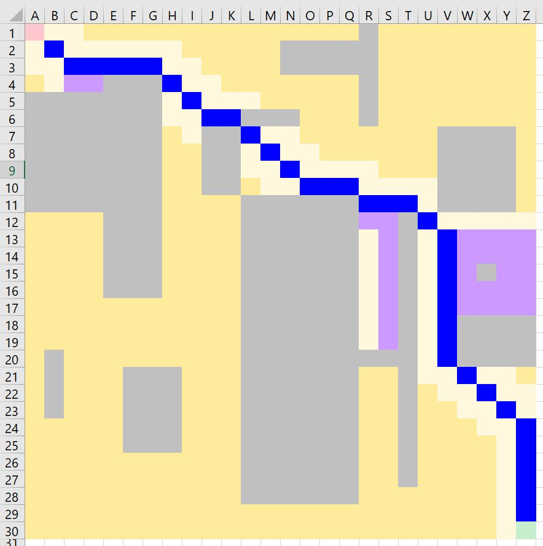

# A* Implementation with VBA and Excel

This is how the algorithm works:
```
MakeProblems() - makes obstacles based on selection 
Reset1() - predefined obstacles, variant 1 
Reset2() - predefined obstacles, variant 2 
Reset() - removes obstacles 
ResetAndKeep() - cleans out everything, keeps the obstacles 
Main() - runs the A* algorithm
```

The new implementation from May 2025:
* https://www.vitoshacademy.com/vba-a-search-algorithm-with-excel/

Old implementations from September 2015:
* https://www.vitoshacademy.com/vba-a-search-algorithm-with-vba-really/
* https://www.vitoshacademy.com/vba-a-search-algorithm-with-vba-teil-zwei/


<br>Notes:
 * The blue cells are the shortest path.
 * The gray cells are obstacles.
 * The light-yellow cells are neighbors, that are not explored.
 * The dark-yellow cells are not explored, not neighbors.
 * The purple cells are explored.

### YouTube videos
 * With explanations - https://youtube.com/watch?v=aKsLs87uv2g
 * Only with maze solving, no talking - https://youtu.be/yAx6QGoOdIs?si=UnbMZT4GfgsjAvAD
