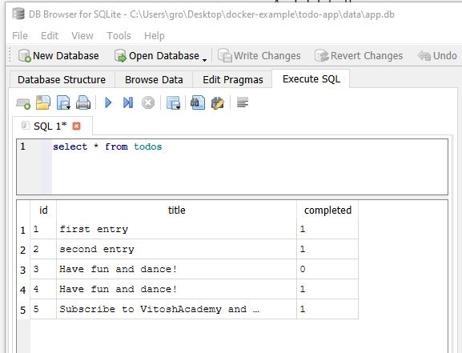

# Docker Basics

## YouTube:
https://youtu.be/gY8BUqdomfE

## VitoshAcademy
https://www.vitoshacademy.com/docker-python-crud-api-excel-vba-all-for-beginners/

## Ways to display the data:

 * With bash:

 * With SQL Lite:

 * With Excel:

 * With Chrome:

