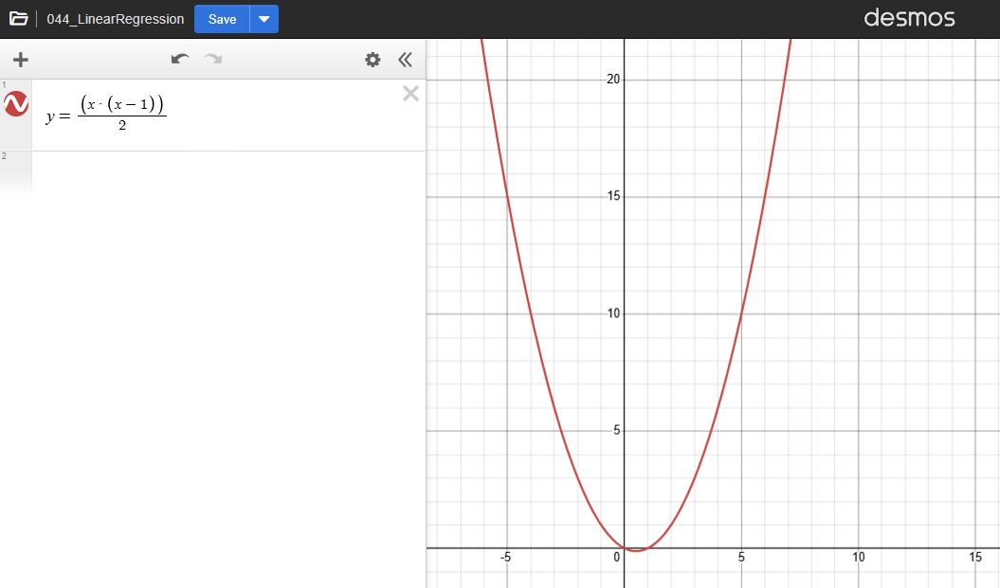

# VitoshAcademy – Talking about Linear Regression again
1) Linear Regression finds coefficients that minimize the sum of squared errors between y and predictions.
2) Straight line: `ŷ = b + m·x` where `m` is slope and `b` is intercept.
3) With features `[x, x²]` the same method fits a parabola: `ŷ = c + b·x + a·x²` (still linear in coefficients).
4) Always plot the data, print the learned formulas, and compare models at your real x values.

# YouTube video link
link

# Desmos Link and picture
[https://www.desmos.com/calculator/bw90fdexbt](https://www.desmos.com/calculator/bw90fdexbt)

