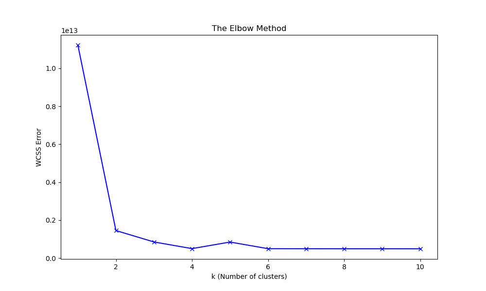
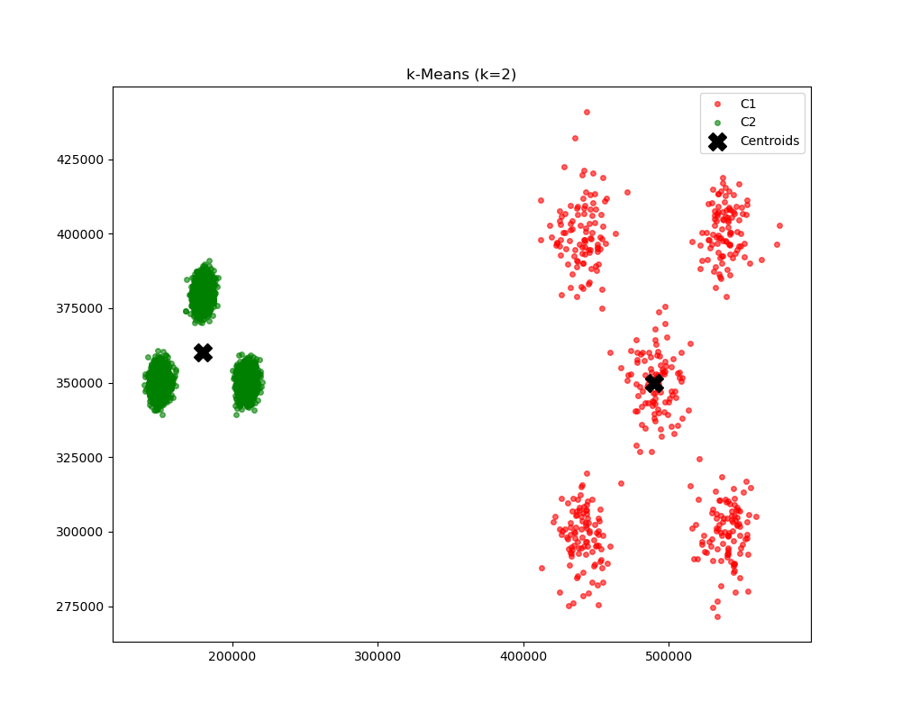

# 🚀 Introduction to k-Means Clustering with Python

This repository contains the Python source code for the **VitoshAcademy** YouTube tutorial. 

It implements the **k-Means Algorithm** entirely from scratch.

## 📺 Watch the Tutorial
[**YouTube Link**](https://youtu.be/h_kNmGRG7FU)

---

## 📊 Results
The algorithm automatically finds the optimal number of clusters using the **Elbow Method** and saves the results to your disk.

### 1. The Elbow Method (Finding K)

### 2. Final Clustering (k=2)

**Happy Coding!** 
🐍🍏🥑
